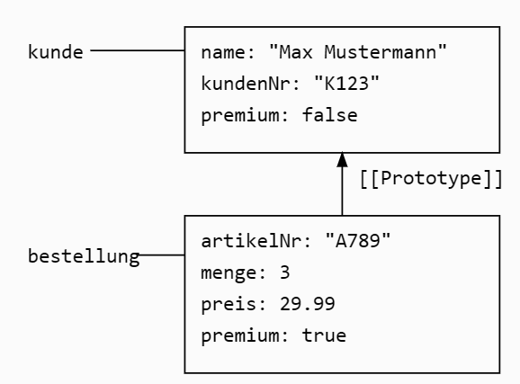

Ich erstelle eine ähnliche Aufgabe zu JavaScript-Objekten:


**JavaScript-Objekte [10 Punkte]**

Die folgende Abbildung zeigt Variablen und Objekte in der aus der Vorlesung bekannten "Kabeldarstellung". Ergänzen Sie mit Hilfe der Objektliteralnotation und weiteren Funktionen von JavaScript den Code, der diese Variablen und Objekte erzeugt.

```
       kunde -----> {{[[Prototype]]}}
                    |  name: "Max Mustermann"
                    |  kundenNr: "K123" 
                    |  premium: false
                    
   bestellung -----> {{[[Prototype]]}}
                    |  artikelNr: "A789"
                    |  menge: 3
                    |  preis: 29.99
                    |  premium: true
```

Sie können die Objekte und ihre Beziehungen mit dem obigen Code überprüfen.

Diese Aufgabe testet:
- Verwendung der Objektliteralnotation
- Anlegen von JavaScript-Objekten mit Eigenschaften
- Setzen von Prototypenbeziehungen zwischen Objekten
- Verständnis der Kabeldarstellung und deren Umsetzung in Code

Die Visualisierung orientiert sich an der Darstellung aus der Vorlesung und der Aufgabe aus der Klausur sose24. Die verwendeten Objekte und Beziehungen sind jedoch anders, um das selbstständige Lösen zu fördern.

Möchten Sie einen Versuch unternehmen, diese Aufgabe zu lösen?



