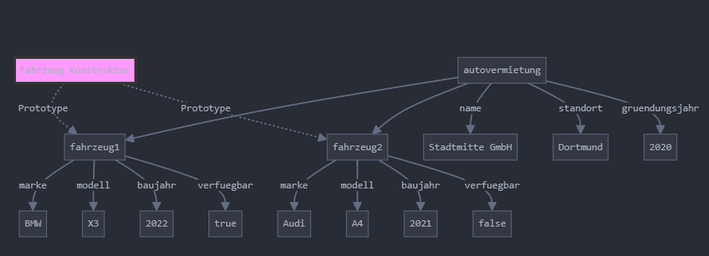

**JavaScript-Objekte [15 Punkte]**

Gegeben ist folgende Objekt-Struktur in der aus der Vorlesung bekannten "Kabeldarstellung":

Lösen Sie die folgenden Teilaufgaben:

a) [5 Punkte] Erzeugen Sie zunächst das Objekt `fahrzeug` als Objektliteral.

b) [5 Punkte] Erstellen Sie eine Konstruktorfunktion `Auto`, die ein Fahrzeug-Objekt mit den Eigenschaften `kennzeichen`, `türen` und `farbe` erzeugt. Verwenden Sie diese Konstruktorfunktion, um das Objekt `meinAuto` zu erstellen.

c) [5 Punkte] Erstellen Sie eine Konstruktorfunktion `Motorrad`, die ein Fahrzeug-Objekt mit den Eigenschaften `kennzeichen`, `leistung` und `farbe` erzeugt. Verwenden Sie diese Konstruktorfunktion, um das Objekt `motorrad1` zu erstellen.

d) [5 Punkte] Setzen Sie die korrekten Prototypenbeziehungen zwischen den Objekten, so dass sowohl Autos als auch Motorräder von `fahrzeug` erben.

Ihre Lösung sollte die gesamte dargestellte Struktur erzeugen. Achten Sie besonders darauf, dass:
- alle Eigenschaften korrekt gesetzt sind
- die Prototypenkette richtig aufgebaut ist
- die Konstruktorfunktionen wiederverwendbar sind

Diese Aufgabe kombiniert die wichtigsten Konzepte:
- Objektliterale für das Basis-Objekt
- Konstruktorfunktionen für die spezialisierten Fahrzeugtypen
- Prototypen für die Vererbungsbeziehungen
- Unterschiedliche Arten der Objekterzeugung

Möchten Sie versuchen, die Aufgabe zu lösen? Ich kann Ihnen dann auch Feedback geben oder die Musterlösung zeigen.

